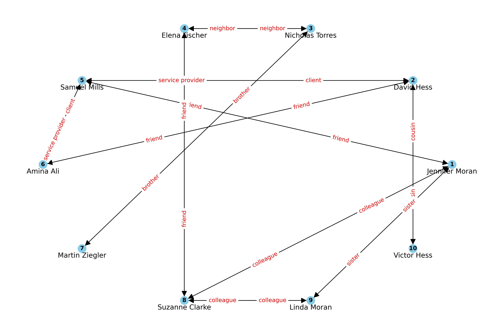
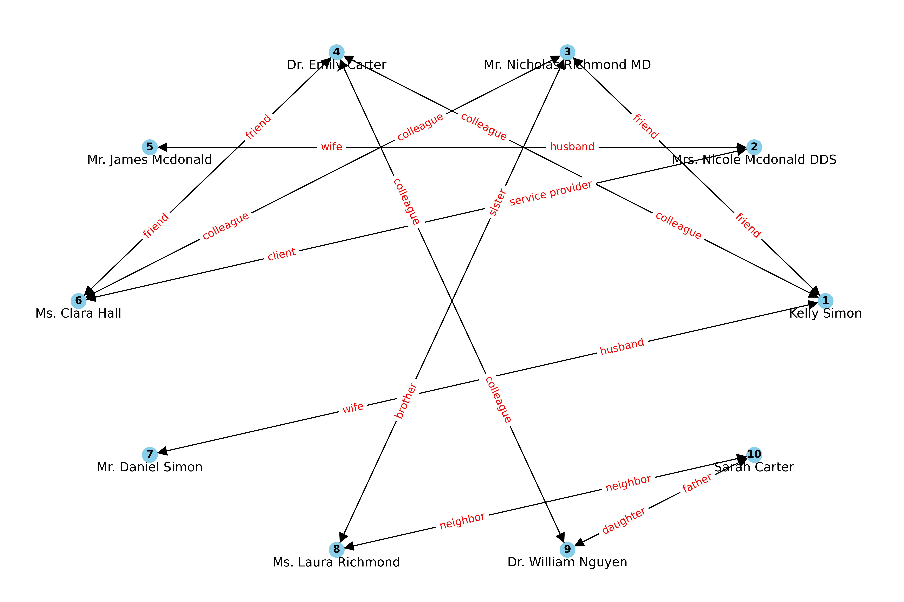
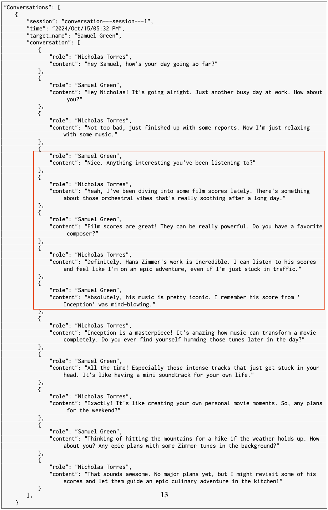
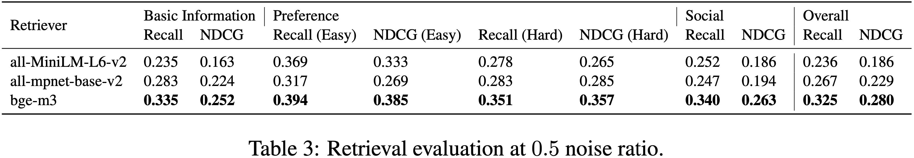
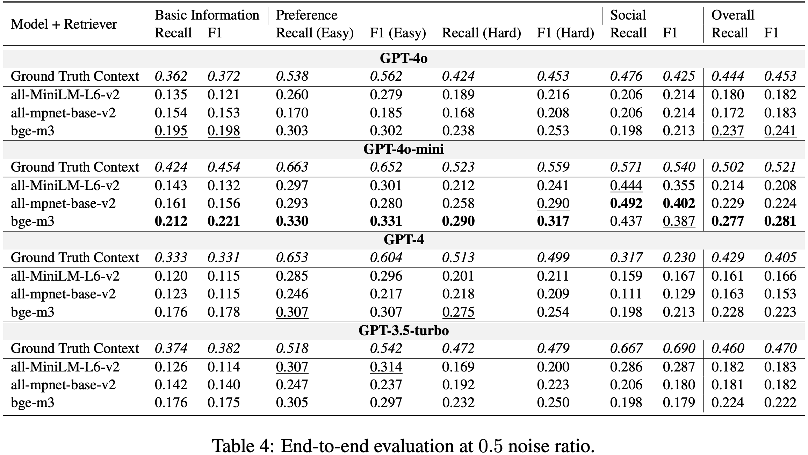
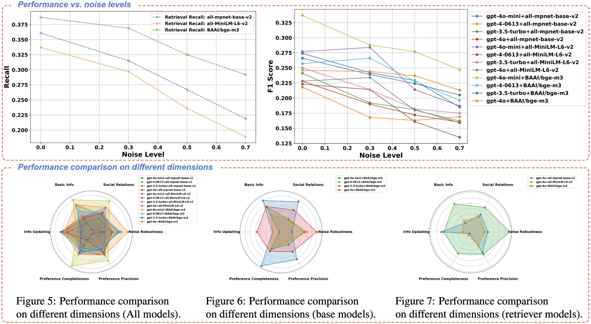

<!-- # PersonaBench -->
<div align="center">
    <h1>👩‍🎓 👨‍⚕️<span style="color:#007BFF; font-weight:bold;">PersonaBench</span> 🏄‍♀️</h1>
</div>

<div align="left">
    <h2 style="font-size: 1.4em;"> Evaluating AI Models on Understanding Personal Information through Accessing (Synthetic) Private User Data </h2>
</div>

<div align="center">
    📃 <a href="">Paper</a> |
    📚 <a href="">Data</a> |
    🌐 <a href="">Website</a>
</div>

## Project Introduction
### 💡 Overview

<div align="center">

</div>

PersonaBench addresses the challenge of evaluating AI models’ ability to personalize interactions using private user data, such as conversation history and app usage, by introducing a synthetic data generation pipeline. This pipeline creates realistic user profiles and private documents simulating human activities, enabling safe and effective model evaluation.

The benchmark focuses on assessing **Retrieval-Augmented Generation (RAG)** pipelines through questions tied to user-specific information supported by synthetic documents. Initial results show that current RAG models struggle with extracting and interpreting personal information, highlighting the need for improved methodologies.

### Features:
- **Synthetic User Documents**: A synthetic data generation pipeline that creates private user documents, including user-user conversations, user-AI interactions, and purchase histories. These documents are grounded in confidential user profiles and designed to simulate realistic human activities.
- **Questions on Personal Information**: For each user, generate questions with ground truth answers about their personal information. These answers can be accurately extracted from specific parts of the user documents.
- **Evaluation Framework**: Evaluate retrieval models for their ability to extract relevant document chunks and evaluate RAG systems for end-to-end Q&A performance.
- **Result Analysis**: Present key results along with detailed fine-grained analyses.

Explore PersonaBench and contribute to advancing AI personalization research!
## 📚 Data Example (v1.0)
***Two communities of data from the PersonaBench dataset have been released in the current version, each giving personal documents and Q&As for three individuals. More data will be released after necessary review. Please don't hesitate to report potential issues or share your suggestions for improving the dataset.***
### Communities
Each node represents an individual with complex user profile attributes, private documents, and questions/answers about personal information.
<p align="center">
  
  
</p>

### Document Examples
An example conversation session between two socially connected individuals. The session reveals one person’s prefered music artist is Hans Zimmer.

<div align="center">

</div>

## Quick Start 
### 🛠️ Installation
Create and activate a new conda environment:
```bash
conda create -n personabench python=3.11
conda activate personabench
```
Install the required packages:
```bash
pip install -r requirements.txt
pip install .
```
Set up OpenAI API key:
```bash
export OPENAI_API_KEY=<your_openai_api_key>
```
### 📝 Evaluation
To test the RAG pipeline on the provided two-community evaluation datasets, simply run the following bash script:
```bash
bash scripts/evaluation/run_test.sh
```
All results will be saved to the logs folder.

Specifically, for testing the RAG framework for answering personal questions using user documents as support context, use the following command:
```bash
python scripts/evaluation/retrieval_and_generation.py --seed 2024 \
    --log_dir logs \
    --data_dir eval_data/eval_data_v1 \
    --test_community_ids community_0,community_1 \
    --num_chunks 5 \
    --base_models gpt-4o-mini,gpt-4-0613,gpt-3.5-turbo,gpt-4o \
    --retrievers all-mpnet-base-v2,gt-context,all-MiniLM-L6-v2,BAAI/bge-m3 \
    --test_noises 0.0,0.3,0.5,0.7 \
    --verbose
```
The generation results will be automatically saved to the specified log_dir.

Then, run the following command to calculate statistics and generate figures:
```bash
python scripts/evaluation/eval.py --log_dir logs \
    --data_dir eval_data/eval_data_v1
```
### 📊 Results
Retrieval evaluation results:
<div align="center">

</div>
End-to-end evaluation results:
<div align="center">

</div>
More detailed evaluation:
<div align="center">

</div>
